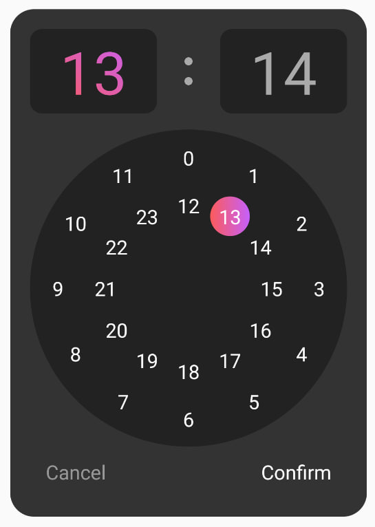
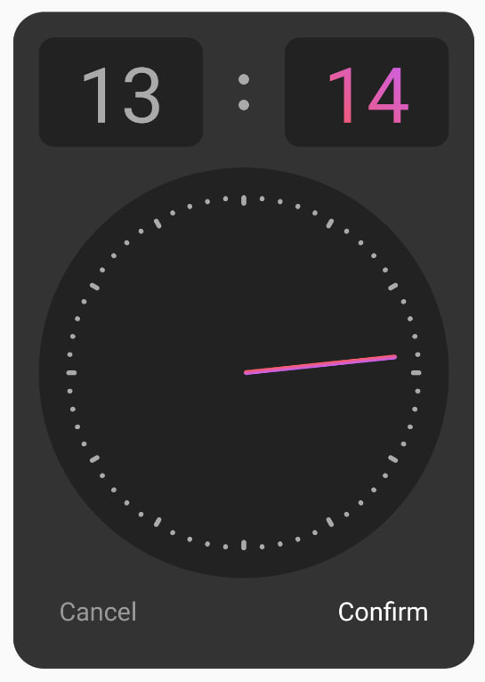
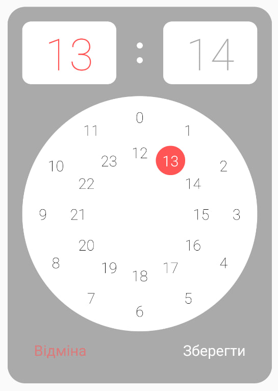
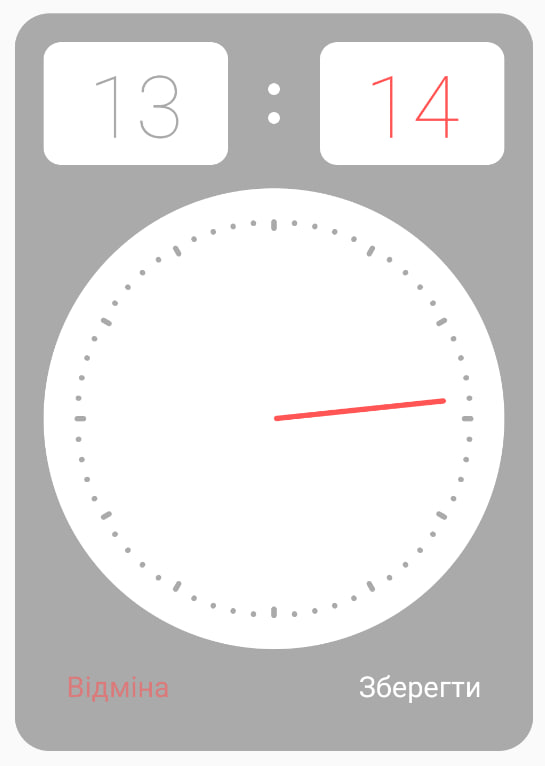

# Time Picker

Bare React Native time picker

### Example of components with default properties

 

```tsx
import TimePicker from './TimePicker/TimePicker';

<TimePicker />;
```

### Usage

Requires `@react-native-masked-view/masked-view` and `react-native-linear-gradient`

```
npm i @react-native-masked-view/masked-view
npm i react-native-linear-gradient
```

Can be used in Expo project with `@react-native-masked-view/masked-view` and `expo-linear-gradient`

Copy ./TimePicker directory and prepare it for usage

```
npm i @react-native-masked-view/masked-view
npm i expo-linear-gradient
```

and replace library in `./components/GradientText.tsx`,`./components/DialBlock.tsx` and `./components/TimeHeader.tsx`

```
- import LinearGradient from 'react-native-linear-gradient';

+ import LinearGradient from 'expo-linear-gradient';
```

### Properties

| Property                  | Type               | Description                                                          |
| ------------------------- | ------------------ | -------------------------------------------------------------------- |
| initialHours              | number             | Initial hours. Use 0-23 range                                        |
| initialMinutes            | number             | Initial minutes. Use 0-59 range                                      |
| containerStyles           | Object             | Styles that will be propagated to the container                      |
| dialStyles                | Object             | Styles that will be propagated to the container of the dial          |
| timeCardStyles            | Object             | Styles that will be propagated to the time card in header            |
| timeTitleStyles           | Object             | Styles that will be propagated to the time title in header           |
| activecolors              | string[]           | Colors that will appear to gradient to actice in dial and header     |
| timeDotColor              | string             | Colors that will appear to dots in header                            |
| dialHourTitleStyles       | Object             | Styles that will be propagated to inactive hour titles in hour dial  |
| dialHourTitleActiveStyles | Object             | Styles that will be propagated to the active hour title in hour dial |
| minuteDotColor            | string             | Colors that will appear to dots in minutes dial                      |
| onSetHours                | function => string | Function after every hours change. Return HH                         |
| onSetMinutes              | function => string | Function after every minutes change. Return MM                       |
| onCancel                  | function => ()     | Function after cancel button pressesd. Return nothing                |
| onConfirm                 | function => string | Function after confirm button pressesd. Returns HH:MM                |
| confirmButtonStyles       | Object             | Styles that will be propagated to the confirm button                 |
| cancelButtonStyles        | Object             | Styles that will be propagated to the cancel button                  |
| confirmButtonTitle        | string             | Text for confirm button                                              |
| cancelButtonTitle         | string             | Text for cancel button                                               |

### Initial values

Initially selected hours and minutes

```tsx
<TimePicker initialHours={12} initialMinutes={53} />
```

### Example of using all styles properties

 

```tsx
<TimePicker
  initialHours={12}
  initialMinutes={53}
  containerStyles={{backgroundColor: '#aaa'}}
  timeCardStyles={{backgroundColor: '#fff'}}
  timeTitleStyles={{fontWeight: '100'}}
  timeDotColor="#FFF"
  dialStyles={{backgroundColor: '#fff'}}
  dialHourTitleStyles={{color: '#000', fontWeight: '100'}}
  dialHourTitleActiveStyles={{color: '#fff', fontWeight: '300'}}
  activecolors={['#ff5555']}
  minuteDotColor="#aaa"
  onSetHours={(value: number) => console.log(value)}
  onSetMinutes={(value: number) => console.log(value)}
  confirmButtonTitle="Зберегти"
  cancelButtonTitle="Відміна"
  confirmButtonStyles={{color: '#FFF'}}
  cancelButtonStyles={{color: '#ff555590'}}
  onCancel={() => console.log('cancel')}
  onConfirm={(value: string) => console.log(value)}
/>
```
